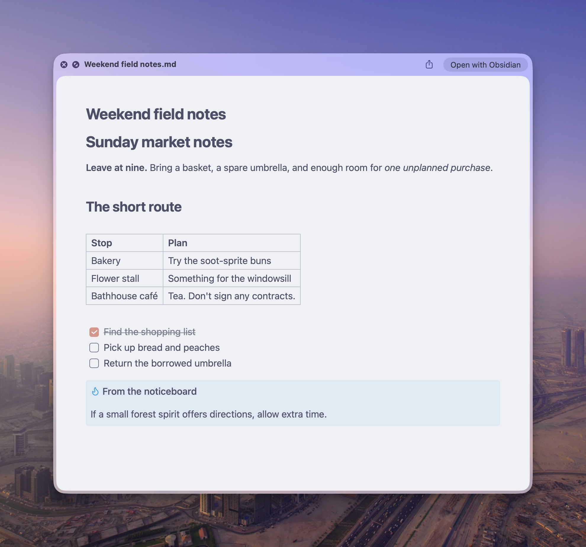
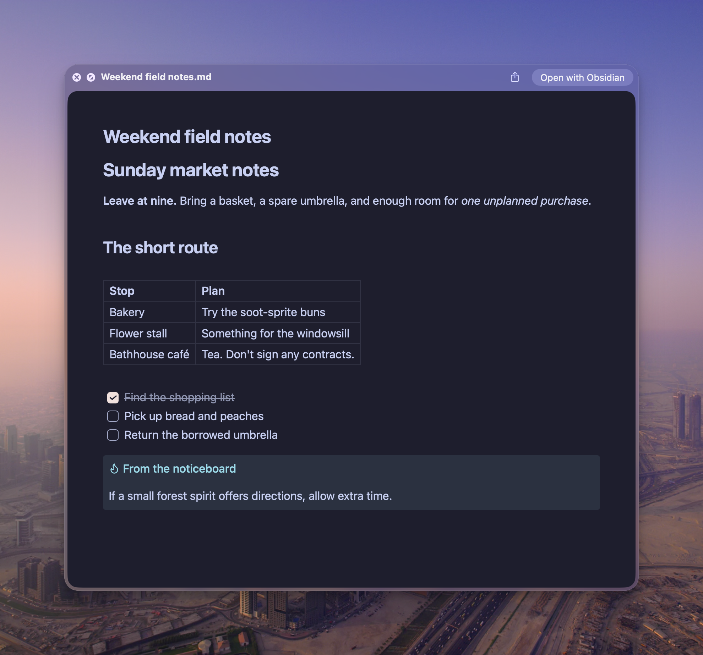
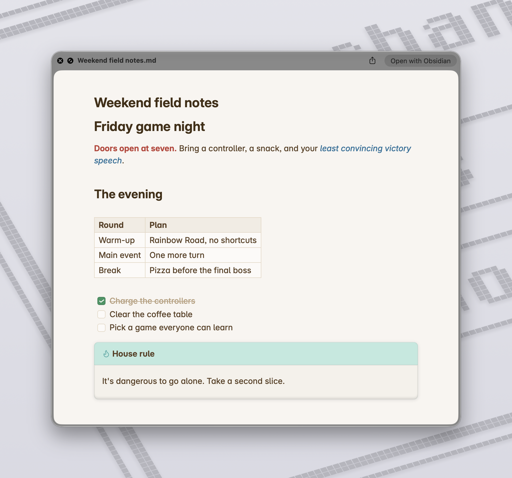
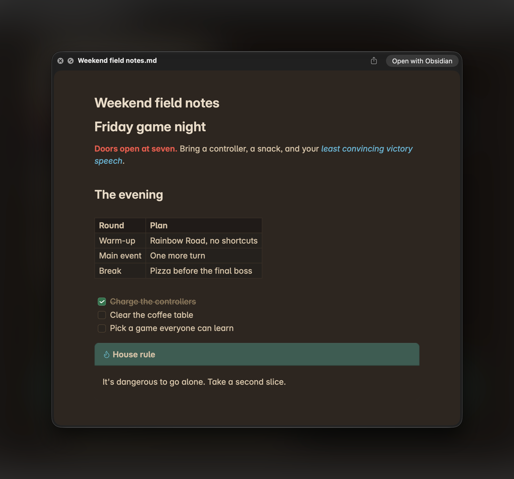
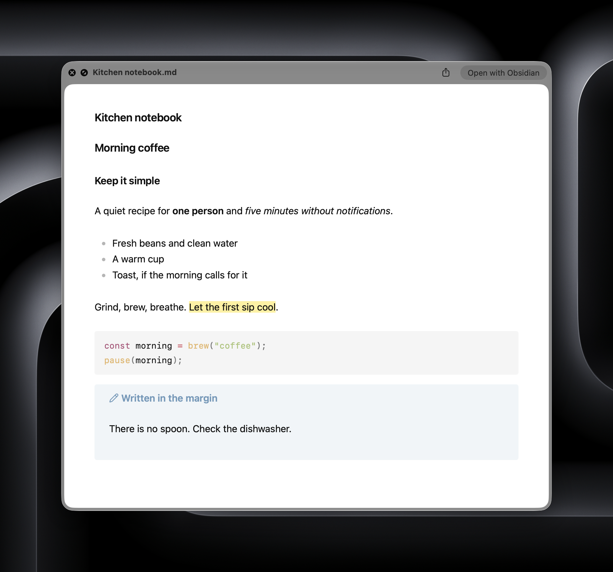
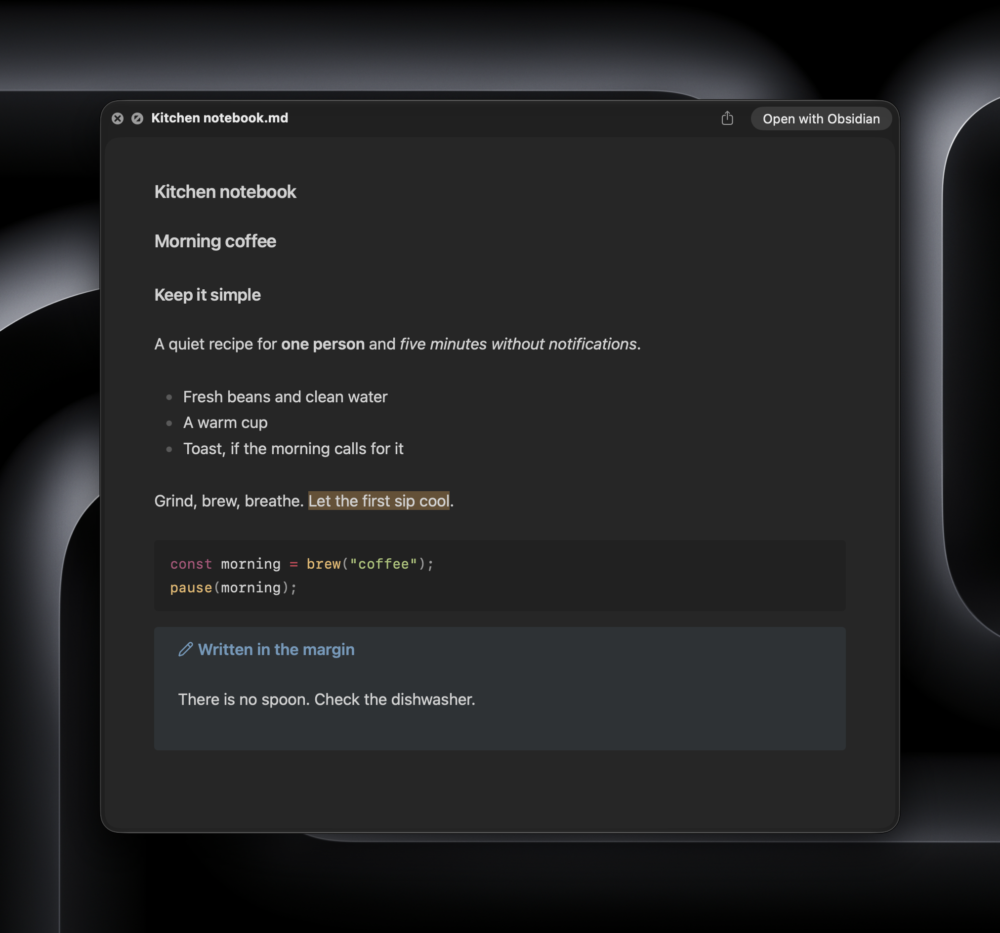
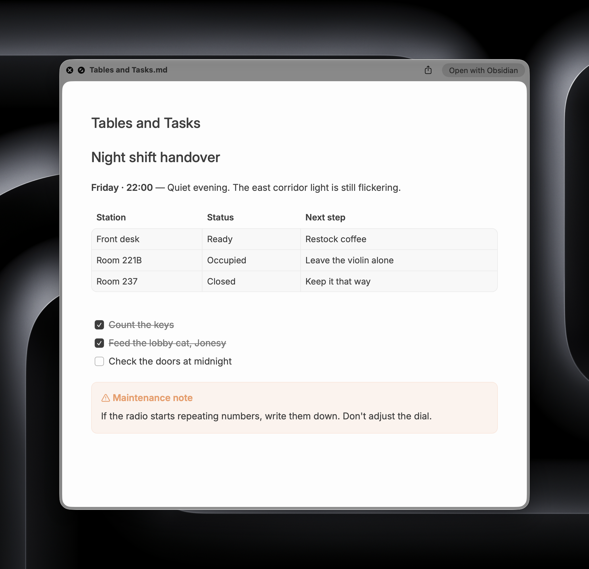
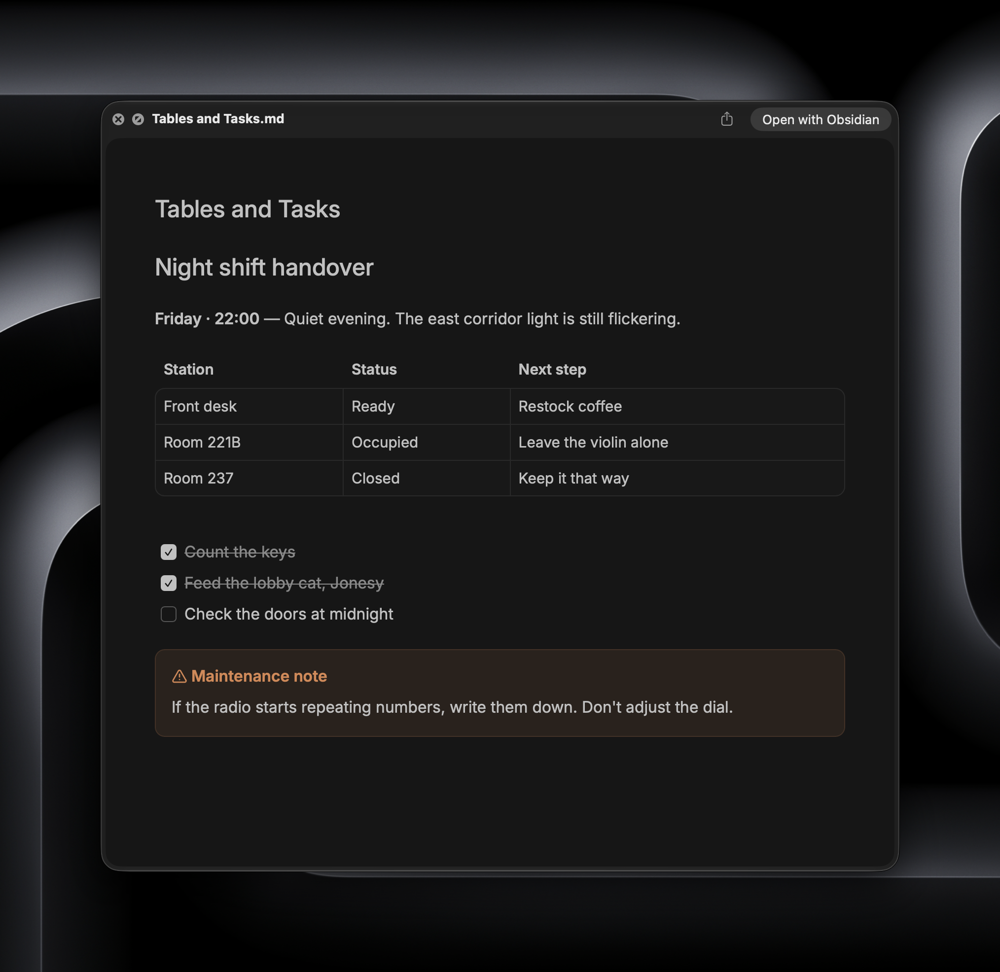

# QuickCss

Your notes look the way you want in Obsidian. They should feel familiar when you preview them in Finder, too.

QuickCss brings your theme, CSS snippets, and Style Settings choices to macOS Quick Look. Fonts, colors, headings, tables, code blocks, quotations, task checkboxes, and common callouts follow your reading appearance automatically. Change your theme and QuickCss picks it up—no second set of appearance sliders to maintain.

## A few familiar looks

The same Quick Look preview, with different themes and settings. These screenshots use sample notes.

### AnuPpuccin

| Light | Dark |
| --- | --- |
|  |  |

<details>
<summary>See Primary, Minimal, and Baseline</summary>

### Primary

| Light | Dark |
| --- | --- |
|  |  |

### Minimal

| Light | Dark |
| --- | --- |
|  |  |

### Baseline

| Light | Dark |
| --- | --- |
|  |  |

</details>

## Before you install

Obsidian added Markdown Quick Look previews in [version 1.14](https://obsidian.md/changelog/2026-10-05-desktop-v1.14.4/). **You need a recent installer**, not just an in-app update. If you've been updating the same installation for a while, [download Obsidian again](https://obsidian.md/download) and reinstall it to get the native extension.

You'll need macOS and Obsidian **1.14.4 or later**. Before installing QuickCss, select a Markdown file in Finder and press **Space**. Obsidian's Markdown preview should already work. QuickCss styles that preview; it doesn't install the extension itself.

Style Settings is optional. If you use it, QuickCss follows its choices along with your enabled snippets and current theme.

## Install

Open **Settings → Community plugins → Browse**, search for **QuickCss**, then choose **Install** and **Enable**.

### Manual installation

If QuickCss isn't available in the community directory yet, or you need a specific release:

1. Download `main.js`, `manifest.json`, and `styles.css` from the [latest release](https://github.com/Mars-den/quickcss/releases/latest).
2. Create a `quickcss` folder in your vault's `.obsidian/plugins` folder.
3. Put the three files inside it.
4. Restart Obsidian and enable **QuickCss** in **Settings → Community plugins**.

If your vault uses a custom configuration folder, use its `plugins` folder instead.

## Try it out

Once enabled, QuickCss follows this vault’s reading appearance and keeps it in sync. Existing users keep this behavior. Select a Markdown file in Finder, press **Space**, and take a look.

Open **Settings → QuickCss**. **Overview** has the sync controls, **Appearance** chooses between following this vault and a fixed theme, **Preview** shows a sample note in light or dark, and **Help** covers vault sharing and troubleshooting. Previews use your **text font**; the **interface font** is a separate setting for Obsidian's menus and settings.

Appearance changes are detected through Obsidian events and style changes. If another plugin changes styling without notifying Obsidian, choose **Sync now** to refresh it.

Already have a Quick Look window open? Close it and open it again after changing your appearance. Existing previews can hang onto the old styling.

| Control | When to use it |
| --- | --- |
| Automatic sync | Leave this on to keep the selected source and snippet files up to date. Turning it off keeps the last applied appearance. |
| Sync now | Refresh immediately, or switch which vault supplies the appearance. |
| Restore and pause | Go back to the native preview and stop syncing. |

### Choose an appearance

**Appearance → Appearance source → Follow this vault** captures the active theme, enabled snippets, and Style Settings as before. **Fixed theme** chooses Default or a theme installed in this vault’s configuration folder. It leaves Obsidian’s own theme untouched and evaluates both light and dark modes using native Quick Look reading defaults. Changes to Obsidian’s active theme, body classes, fonts, or Style Settings do not change that fixed appearance. Theme features that require plugin classes or Style Settings may therefore differ from their appearance in Obsidian.

The compact **Quick Look snippets** list reads existing `.css` files from your configuration folder’s `snippets` directory. Create or edit those files with your usual editor, then refresh the installed-file list if necessary. QuickCss does not change Obsidian’s snippet toggles.

- **Follow this vault:** selected snippets are additions to the vault’s enabled snippets. Turning a toggle off here removes only that addition; it cannot disable a snippet enabled in Obsidian. An already-enabled file is not added twice.
- **Fixed theme:** only snippets selected here are included, after the chosen theme, in alphabetical filename order.

Selected files are evaluated against synthetic Markdown and exported through the same safe computed-style capture as the vault source. Raw CSS is not copied to Finder. With automatic sync on, source-file changes trigger capture; while paused, selections are saved for the next **Sync now**. Missing selected files block capture and preserve the last applied appearance until you remove the selection or restore the file.

A saved appearance and a successful cache write are tracked separately. Failed writes remain retryable by the owning vault and are not shown as a successfully applied selection. **Sync now** retries; cache monitoring also retries when relevant resources change.

### A note about multiple vaults

Quick Look belongs to your Mac, so all your vaults share one preview appearance. One vault supplies the styling at a time. Choose **Sync now** when you want another vault's look instead.

Disabling QuickCss in the source vault restores the native styling. Disabling it in a following vault leaves the source's styling alone. Closing Obsidian normally keeps your last appearance available in Finder.

QuickCss listens for Quick Look cache changes without a recurring scan. Keep the source vault open so it can reapply your styling if Obsidian replaces the cache. If file monitoring is unavailable, **Sync now** retries it and refreshes the styling.

## A few things to know

Quick Look and Obsidian use different renderers, so some text and layout details may differ. Fonts installed on your Mac work best; fonts supplied only through a theme or a download may fall back.

Editor styling, plugin widgets, note-specific CSS classes, interactive effects, and unusual callouts aren't fully supported. External images and font assets aren't copied. Simple inline SVG checkbox marks can be captured.

QuickCss works through Obsidian's **undocumented Quick Look cache**, so an Obsidian or macOS update could change how it works. This is an independent plugin.

## Something looks wrong?

**No Markdown preview in Finder?** Download and reinstall the latest Obsidian installer first. If another app handles Markdown previews on your Mac, make sure you're seeing Obsidian's native preview.

**Still seeing the old appearance?** Choose **Sync now**, then close and reopen Quick Look. Finder sometimes caches previews; try a newly created Markdown file if it keeps showing the old one.

**Seeing another vault's theme?** Open the vault you want and choose **Sync now**.

**Wrong font?** Check your text/reading font in Obsidian or Style Settings, rather than the interface font. Try a font installed on your Mac.

**Want to undo it?** Choose **Restore and pause**, or disable QuickCss in the source vault. Reopen Quick Look afterward.

## Privacy and file access

Everything happens locally. QuickCss has no telemetry, network requests, account requirement, or advertising. It reads appearance styles and settings, checks them against sample Markdown, and saves the resulting styling. **It does not read or edit your notes.**

Finder previews live outside your vault, so QuickCss accesses:

- `~/Library/Application Support/obsidian/quicklook/` to add a removable CSS block to the native Quick Look cache.
- `~/Library/Application Support/QuickCss/` to keep the shared appearance, source-vault label, and original CSS backups.

Restoration removes QuickCss's own block and keeps unrelated CSS. It doesn't modify the signed Obsidian application bundle or run a background service after Obsidian closes.

## Bugs and ideas

[Open an issue](https://github.com/Mars-den/quickcss/issues). For a styling mismatch, a small example note and screenshots of the two previews help. Please use sample content rather than private notes.

## Build from source

```sh
npm ci
npm run format:check
npm test
npm run build
```

Install the generated `main.js` with `manifest.json` and `styles.css`. Releases are built in GitHub Actions with artifact attestations for the three files.

Source and tests use normal formatting and descriptive names. Run `npm run format` before contributing; CI checks formatting with `npm run format:check`.

## License

[MIT](LICENSE) © 2026 Mars-den.
